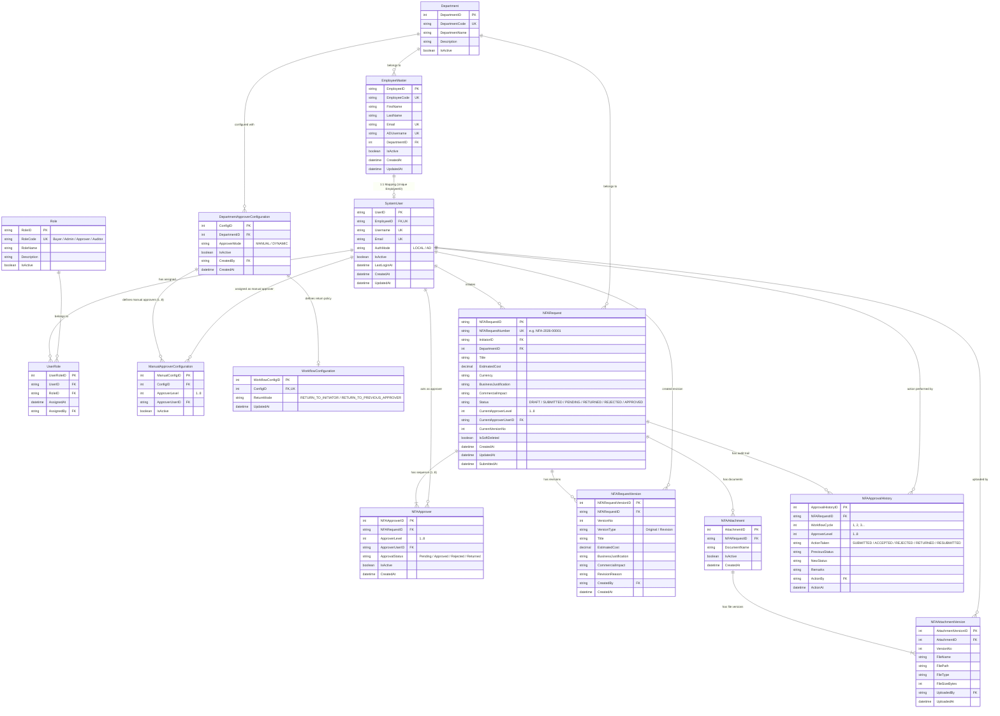

# NFA WORKFLOW MANAGEMENT SYSTEM
## Entity Relationship Diagram (ERD) Specification & Database Schema Design

**Project:** NFA — Note for Approval Workflow Management System  
**Document Type:** ERD Specification & Technical Review  
**Version:** 1.0  
**Status:** Approved Schema Reference  

---

# 1. Executive Review of Provided ERD Diagram (`ERD.png`)

We performed a comprehensive audit comparing the provided diagram (`ERD.png`) against the **Business Requirements Document (BRD)** and **Technical Requirements & Design Document**.

### 🟢 What is Correct & Well-Designed in `ERD.png`:
1. **Strict Employee-to-User Mapping**: 1:1 relationship between `EmployeeMaster` and `SystemUser` with `EmployeeID (Unique)` enforces zero duplicate users per employee.
2. **Flexible Multi-Role Architecture**: Junction table `UserRole` (`SystemUser` ↔ `UserRole` ↔ `Role`) cleanly handles users with multiple roles (e.g. `Buyer` + `Approver`).
3. **Approver Sequence Control**: `NFAApprover` enforces sequential approval levels ($1..8$).
4. **Attachment Version Control**: Two-tier attachment design (`NFAAttachment` + `NFAAttachmentVersion`) preserves old files on Return/Revision.
5. **Immutable History Log**: `NFAApprovalHistory` tracks all workflow actions.

---

### 🟡 Required Enhancements & Corrections:

| Component | Observation in `ERD.png` | Required Correction per BRD & Tech Spec |
| :--- | :--- | :--- |
| **Table Name** | Spelled `NFARequset` (Typo) | Correct spelling to **`NFARequest`**. |
| **Request Fields** | Has `Title` and `Purpose` | Split `Purpose` into explicit **`BusinessJustification`** and **`CommercialImpact`** fields per BRD Section 11. |
| **Return Modes** | `ReturnBehavior (StepBack)` | Expand options to support both **`RETURN_TO_INITIATOR`** and **`RETURN_TO_PREVIOUS_APPROVER`** (StepBack) per BRD Section 17. |
| **Request Revisions** | `NFARequestVersion` only has metadata | Add snapshot fields (`Title`, `EstimatedCost`, `BusinessJustification`, `CommercialImpact`) to record full content per revision. |
| **Audit History** | Missing cycle counter | Add **`WorkflowCycle`** (Int), **`PreviousStatus`**, and **`NewStatus`** to `NFAApprovalHistory` per BRD Section 21 & 23. |

---

# 2. Complete Complete ERD Mermaid Diagram

Below is the complete, corrected Entity Relationship Diagram formatted for GFM / Mermaid rendering:

---

# 3. Detailed Data Dictionary & Schema Specification

### 3.1 `EmployeeMaster` (Company Employee Directory)
* **`EmployeeID`** (PK, VARCHAR(50)): Unique Employee Identifier.
* **`EmployeeCode`** (VARCHAR(50), Unique): Company employee code (e.g. `EMP001`).
* **`DepartmentID`** (FK to `Department`): Employee's default department.

### 3.2 `SystemUser` (System Participants)
* **`UserID`** (PK, VARCHAR(50)): System User ID.
* **`EmployeeID`** (FK to `EmployeeMaster`, UNIQUE): Ensures 1:1 mapping with Employee Master.

### 3.3 `UserRole` (Role Assignment Junction)
* **`UserID`** (FK), **`RoleID`** (FK): Multi-role mapping supporting Buyer, Admin, Approver, and Auditor roles simultaneously per user.

### 3.4 `DepartmentApproverConfiguration` & `WorkflowConfiguration`
* **`ApproverMode`**: Enum (`MANUAL`, `DYNAMIC`).
* **`ReturnMode`**: Enum (`RETURN_TO_INITIATOR`, `RETURN_TO_PREVIOUS_APPROVER`).

### 3.5 `NFARequest` & `NFARequestVersion`
* **`NFARequestNumber`**: Human-readable unique string (e.g. `NFA-2026-00001`).
* **`BusinessJustification` & `CommercialImpact`**: Explicit text fields for request justification per BRD Section 11.
* **`NFARequestVersion`**: Snapshots the request content on each Return & Resubmit cycle.

### 3.6 `NFAApprovalHistory` (Append-Only Audit Log)
* **`WorkflowCycle`**: Tracks workflow cycle iterations ($1, 2, 3\dots$) across returns and resubmissions.
* **`ActionTaken`**: (`SUBMITTED`, `ACCEPTED`, `REJECTED`, `RETURNED`, `RESUBMITTED`). Never updated or deleted.
